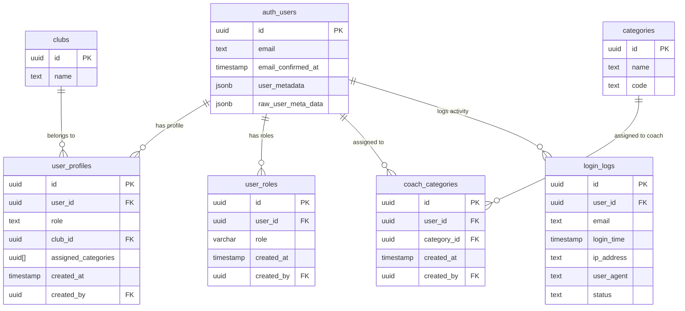

# Database Tables Overview - User & Authentication System

This document provides a comprehensive overview of all user and authentication related tables in the TJ Sokol Svinov system.

## 📋 Table of Contents

1. [Core Authentication Tables](#core-authentication-tables)
2. [User Management Tables](#user-management-tables)
3. [Role & Permission Tables](#role--permission-tables)
4. [Logging & Audit Tables](#logging--audit-tables)
5. [Views & Functions](#views--functions)
6. [Table Relationships](#table-relationships)
7. [Security & RLS Policies](#security--rls-policies)

---

## 🔐 Core Authentication Tables

### `auth.users` (Supabase Built-in)
**Purpose**: Core user authentication and basic profile information managed by Supabase Auth.

```sql
-- This is a Supabase built-in table, not created by us
-- Contains: id, email, encrypted_password, email_confirmed_at, 
--           raw_user_meta_data, user_metadata, created_at, updated_at, etc.
```

**Key Fields**:
- `id` (UUID) - Primary key, references other tables
- `email` (TEXT) - User's email address
- `email_confirmed_at` (TIMESTAMP) - Email verification status
- `user_metadata` (JSONB) - Custom user data (full_name, phone, bio, position, is_blocked)
- `raw_user_meta_data` (JSONB) - Additional metadata from auth providers

**Usage**: 
- Primary user identity
- Authentication and session management
- Referenced by all other user-related tables

---

## 👤 User Management Tables

### `user_profiles`
**Purpose**: Extended user profile information and role assignments.

```sql
CREATE TABLE user_profiles (
    id UUID DEFAULT gen_random_uuid() PRIMARY KEY,
    user_id UUID NOT NULL REFERENCES auth.users(id) ON DELETE CASCADE,
    role TEXT NOT NULL CHECK (role IN ('admin', 'coach', 'head_coach', 'member')),
    club_id UUID REFERENCES clubs(id),
    assigned_categories UUID[] DEFAULT NULL,
    created_at TIMESTAMP WITH TIME ZONE DEFAULT NOW(),
    updated_at TIMESTAMP WITH TIME ZONE DEFAULT NOW(),
    created_by UUID REFERENCES auth.users(id)
);
```

**Key Fields**:
- `user_id` (UUID) - References `auth.users(id)`
- `role` (TEXT) - User's primary role: admin, coach, head_coach, member
- `club_id` (UUID) - Associated club (nullable)
- `assigned_categories` (UUID[]) - Categories assigned to coaches (null for non-coaches)

**Constraints**:
- `check_assigned_categories_coach_only` - Only coaches can have assigned categories
- `user_profiles_role_check` - Role must be one of the allowed values

**Usage**:
- **Primary role storage** for the application
- **Middleware checks** this table for access control
- **Role-based redirects** after login

---

## 🎭 Role & Permission Tables

### `user_roles`
**Purpose**: Legacy role system (being phased out in favor of `user_profiles`).

```sql
CREATE TABLE user_roles (
    id UUID DEFAULT gen_random_uuid() PRIMARY KEY,
    user_id UUID NOT NULL REFERENCES auth.users(id) ON DELETE CASCADE,
    role VARCHAR(20) NOT NULL CHECK (role IN ('admin', 'coach')),
    created_at TIMESTAMP WITH TIME ZONE DEFAULT NOW(),
    created_by UUID REFERENCES auth.users(id),
    UNIQUE(user_id, role)
);
```

**Key Fields**:
- `user_id` (UUID) - References `auth.users(id)`
- `role` (VARCHAR) - Legacy roles: admin, coach
- `created_by` (UUID) - Who assigned this role

**Usage**:
- **Legacy system** - being replaced by `user_profiles.role`
- **Backward compatibility** for existing data
- **Helper functions** still check this table

### `coach_categories`
**Purpose**: Category assignments for coaches (legacy system).

```sql
CREATE TABLE coach_categories (
    id UUID DEFAULT gen_random_uuid() PRIMARY KEY,
    user_id UUID NOT NULL REFERENCES auth.users(id) ON DELETE CASCADE,
    category_id UUID NOT NULL REFERENCES categories(id) ON DELETE CASCADE,
    created_at TIMESTAMP WITH TIME ZONE DEFAULT NOW(),
    created_by UUID REFERENCES auth.users(id),
    UNIQUE(user_id, category_id)
);
```

**Key Fields**:
- `user_id` (UUID) - References `auth.users(id)`
- `category_id` (UUID) - References `categories(id)`
- `created_by` (UUID) - Who made the assignment

**Usage**:
- **Legacy system** - being replaced by `user_profiles.assigned_categories`
- **Many-to-many** relationship between users and categories
- **Access control** for coach-specific features

---

## 📊 Logging & Audit Tables

### `login_logs`
**Purpose**: Track user authentication attempts and sessions.

```sql
CREATE TABLE login_logs (
    id UUID DEFAULT gen_random_uuid() PRIMARY KEY,
    user_id UUID, -- No foreign key constraint (nullable for failed attempts)
    email TEXT NOT NULL,
    login_time TIMESTAMP WITH TIME ZONE DEFAULT NOW(),
    ip_address TEXT,
    user_agent TEXT,
    status TEXT NOT NULL CHECK (status IN ('success', 'failed', 'pending')),
    session_id TEXT,
    created_at TIMESTAMP WITH TIME ZONE DEFAULT NOW()
);
```

**Key Fields**:
- `user_id` (UUID) - References `auth.users(id)` (nullable for failed attempts)
- `email` (TEXT) - Email used in login attempt
- `login_time` (TIMESTAMP) - When the attempt occurred
- `ip_address` (TEXT) - User's IP address
- `user_agent` (TEXT) - Browser/device information
- `status` (TEXT) - success, failed, or pending

**Usage**:
- **Security monitoring** - track failed login attempts
- **Audit trail** - who logged in when and from where
- **Analytics** - user activity patterns

---

## 🔍 Views & Functions

### `user_role_summary` (View)
**Purpose**: Comprehensive view combining user data from multiple tables.

```sql
CREATE VIEW user_role_summary AS
SELECT 
    u.id as user_id,
    u.email,
    COALESCE(
        up.full_name,
        u.raw_user_meta_data->>'full_name',
        u.email
    ) as full_name,
    up.role as profile_role,
    COALESCE(array_agg(DISTINCT ur.role) FILTER (WHERE ur.role IS NOT NULL), '{}') as roles,
    COALESCE(array_agg(DISTINCT cc.category_id) FILTER (WHERE cc.category_id IS NOT NULL), '{}') as assigned_categories,
    COALESCE(array_agg(DISTINCT c.name) FILTER (WHERE c.name IS NOT NULL), '{}') as assigned_category_names,
    COALESCE(array_agg(DISTINCT c.code) FILTER (WHERE c.code IS NOT NULL), '{}') as assigned_category_codes
FROM auth.users u
LEFT JOIN user_profiles up ON u.id = up.user_id
LEFT JOIN user_roles ur ON u.id = ur.user_id
LEFT JOIN coach_categories cc ON u.id = cc.user_id
LEFT JOIN categories c ON cc.category_id = c.id
GROUP BY u.id, u.email, up.full_name, u.raw_user_meta_data, up.role;
```

**Key Fields**:
- `user_id` (UUID) - User identifier
- `email` (TEXT) - User's email
- `full_name` (TEXT) - User's display name
- `profile_role` (TEXT) - Primary role from user_profiles
- `roles` (TEXT[]) - All roles from user_roles table
- `assigned_categories` (UUID[]) - Category assignments

**Usage**:
- **Admin panel** - display user information
- **API endpoints** - get comprehensive user data
- **Role management** - view all user roles and permissions

### Helper Functions

#### `is_admin(user_uuid UUID)`
**Purpose**: Check if user has admin role (avoids RLS recursion).

```sql
CREATE OR REPLACE FUNCTION is_admin(user_uuid UUID DEFAULT auth.uid())
RETURNS BOOLEAN AS $$
BEGIN
    RETURN EXISTS (
        SELECT 1 FROM user_profiles up
        WHERE up.user_id = user_uuid 
        AND up.role = 'admin'
    );
END;
$$ LANGUAGE plpgsql SECURITY DEFINER;
```

#### `has_admin_access(user_uuid UUID)`
**Purpose**: Check admin access across both new and legacy systems.

```sql
CREATE OR REPLACE FUNCTION has_admin_access(user_uuid UUID DEFAULT auth.uid())
RETURNS BOOLEAN AS $$
BEGIN
    -- Check new role system first
    IF EXISTS (
        SELECT 1 FROM user_roles ur 
        WHERE ur.user_id = user_uuid 
        AND ur.role = 'admin'
    ) THEN
        RETURN TRUE;
    END IF;
    
    -- Fallback to old role system
    RETURN EXISTS (
        SELECT 1 FROM user_profiles up
        WHERE up.user_id = user_uuid 
        AND up.role = 'admin'
    );
END;
$$ LANGUAGE plpgsql SECURITY DEFINER;
```

---

## 🔗 Table Relationships



---

## 🛡️ Security & RLS Policies

### Row Level Security (RLS)
All user-related tables have RLS enabled with the following policies:

#### `user_profiles` RLS Policies
- **Users can read their own profile**: `user_id = auth.uid()`
- **Users can update their own profile**: `user_id = auth.uid()` (with role protection)
- **Admins can read all profiles**: `is_admin(auth.uid())`
- **Admins can manage all profiles**: `is_admin(auth.uid())`

#### `user_roles` RLS Policies
- **Users can view their own roles**: `user_id = auth.uid()`
- **Admins can manage all roles**: `has_admin_access()`
- **Service role bypass**: `auth.role() = 'service_role'`

#### `login_logs` RLS Policies
- **Authenticated users can read logs**: `auth.role() = 'authenticated'`
- **Authenticated users can insert logs**: `auth.role() = 'authenticated'`

---

## 📝 Usage Guidelines

### For New Users
1. **User created** in `auth.users` (via Supabase Auth)
2. **Profile created** in `user_profiles` with appropriate role
3. **Role assignment** determines access level

### For Role Management
- **Primary system**: Use `user_profiles.role`
- **Legacy support**: `user_roles` table still exists for backward compatibility
- **Category assignments**: Use `user_profiles.assigned_categories` for coaches

### For Access Control
- **Middleware checks**: `user_profiles` table for role verification
- **API endpoints**: Use helper functions like `is_admin()`
- **UI components**: Check user role for conditional rendering

### For Monitoring
- **Login tracking**: All authentication attempts logged in `login_logs`
- **User activity**: Monitor via `user_role_summary` view
- **Security**: Failed login attempts tracked for security analysis

---

## 🔄 Migration Notes

### From Legacy to New System
- **Old system**: `user_roles` + `coach_categories` tables
- **New system**: `user_profiles` table with `assigned_categories` array
- **Migration**: Helper functions check both systems for backward compatibility
- **Future**: Legacy tables will be deprecated once migration is complete

### Data Consistency
- **Primary source**: `user_profiles.role` is the authoritative role
- **Fallback**: `user_roles` table provides backward compatibility
- **Views**: `user_role_summary` combines data from both systems

---

## 🚨 Important Notes

1. **`user_profiles` is the primary role table** - middleware and access control use this
2. **`user_roles` is legacy** - being phased out but still supported
3. **RLS policies prevent recursion** - use helper functions for role checks
4. **Email is stored in `auth.users`** - not in custom tables
5. **Category assignments** are moving from `coach_categories` to `user_profiles.assigned_categories`

This system provides a robust, secure, and scalable foundation for user management and role-based access control.
