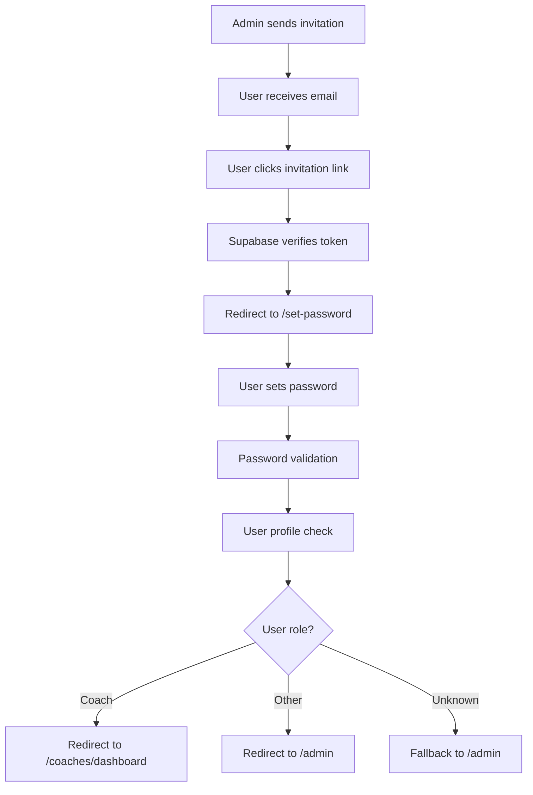

# User Invitation Flow - Complete Solution

## Problem Analysis

The original system had a basic email template that redirected users to the homepage after accepting invitations, leaving them without a clear path to set up their password and access the system.

## Solution Overview

We've created a complete user invitation flow that provides a professional, user-friendly experience for new users joining the TJ Sokol Svinov system.

## What Was Created

### 1. **Professional Email Templates**
- **HTML Template** (`email-templates/invite-user-template.html`)
  - Modern, responsive design with club branding
  - Czech language content
  - Clear call-to-action button
  - Security information and contact details

- **Plain Text Template** (`email-templates/invite-user-template.txt`)
  - Fallback for email clients that don't support HTML
  - Clean, readable format

### 2. **Set Password Page** (`src/app/set-password/page.tsx.backup`)
- Dedicated page for new users to set their password
- Password strength validation
- Professional UI with club branding
- Automatic role-based redirect after password setup
- Error handling for expired/invalid links

### 3. **Updated Routes** (`src/routes/routes.ts`)
- Added `setPassword: '/set-password'` to public routes

### 4. **Documentation**
- **Quick Setup Guide** (`docs/QUICK_EMAIL_SETUP.md`)
- **Comprehensive Setup Guide** (`docs/EMAIL_TEMPLATES_SETUP.md`)
- **This Solution Overview** (`docs/INVITATION_FLOW_SOLUTION.md`)

## Complete User Flow



## Technical Implementation

### Email Template Updates
The invitation links now include a redirect parameter:
```
{{ .ConfirmationURL }}?next={{ .SiteURL }}/set-password
```

### Set Password Page Features
- **Password Requirements**: 8+ characters, uppercase, lowercase, number, special character
- **Real-time Validation**: Visual feedback on password strength
- **Error Handling**: Clear messages for expired/invalid links
- **Success Flow**: Automatic redirect after password setup
- **Role Detection**: Checks user profile to determine appropriate redirect

### Security Features
- Token validation through Supabase Auth
- Password strength requirements
- Automatic session management
- Error handling for edge cases

## Setup Instructions

### 1. **Update Supabase Email Templates**
1. Go to Supabase Dashboard → Authentication → Email Templates
2. Select "Invite user" template
3. Replace HTML content with `email-templates/invite-user-template.html`
4. Replace plain text content with `email-templates/invite-user-template.txt`
5. Save changes

### 2. **Deploy New Page**
The set-password page is already created and ready to use. No additional deployment steps needed.

### 3. **Test the Flow**
1. Create a test user invitation
2. Check the received email
3. Click the invitation link
4. Verify redirect to set-password page
5. Set password and verify redirect to appropriate dashboard

## Benefits

### For Users
- **Clear Instructions**: Professional email with clear next steps
- **Easy Setup**: Simple password creation process
- **Automatic Access**: Immediate access to appropriate dashboard
- **Security**: Strong password requirements

### For Administrators
- **Professional Image**: High-quality email templates
- **Reduced Support**: Clear instructions reduce user confusion
- **Better UX**: Smooth onboarding experience
- **Role Management**: Automatic redirect based on user roles

### For the System
- **Security**: Proper password validation and token handling
- **Scalability**: Works with existing Supabase Auth system
- **Maintainability**: Clean, documented code
- **Flexibility**: Easy to customize and extend

## Customization Options

### Email Templates
- Colors and branding
- Content and messaging
- Contact information
- Security notices

### Set Password Page
- Password requirements
- UI styling
- Redirect logic
- Error messages

### User Roles
- Add new role types
- Customize redirect destinations
- Modify role detection logic

## Monitoring and Maintenance

### Regular Checks
- Test invitation flow monthly
- Monitor email delivery rates
- Check for user feedback
- Update contact information as needed

### Troubleshooting
- Check Supabase Auth logs
- Verify email template configuration
- Test with different email clients
- Monitor redirect success rates

## Future Enhancements

### Potential Improvements
- [ ] Multi-language support
- [ ] A/B testing for templates
- [ ] Advanced personalization
- [ ] Analytics integration
- [ ] Welcome email after password setup
- [ ] User onboarding checklist

### Additional Templates
- Password reset emails
- Account confirmation
- Security notifications
- Role change notifications

## Conclusion

This solution provides a complete, professional user invitation flow that enhances the user experience while maintaining security and system integrity. The implementation is ready to use and can be easily customized to meet future needs.
